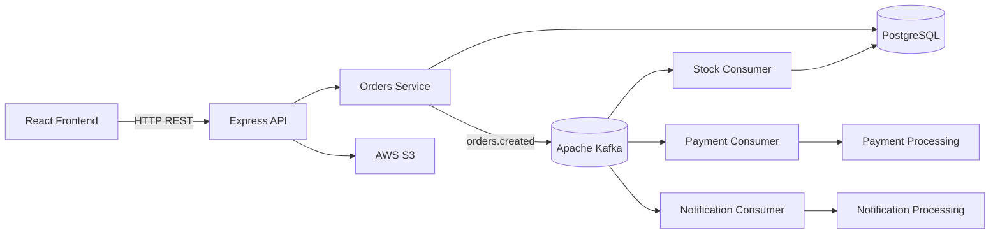

# 🛒 E-commerce with Kafka

> Full-stack mini e-commerce built to demonstrate an event-driven architecture with **Node.js, React, PostgreSQL, Apache Kafka and Docker**.

A monorepo containing a React frontend and a Node.js REST API. The application implements common e-commerce flows such as authentication, product browsing, favorites, shopping cart and order creation, while using **Apache Kafka to decouple order processing from payment, stock and notification consumers**.

---

## ✨ Features

### 🛍️ E-commerce

- Product catalog
- Product details with color and size selection
- Shopping cart
- Quantity and size updates
- Favorites / wishlist
- Order checkout
- Order history
- Responsive interface
- Loading, empty and error states

### 👤 Authentication

- User registration
- Login
- Logout
- JWT-based authentication
- Authentication through HTTP-only cookies
- Protected frontend routes
- Persistent frontend authentication state

### ⚡ Event-driven processing

- Apache Kafka
- `orders.created` topic
- Dedicated Kafka producer
- Independent consumers for:
  - Payment
  - Stock
  - Notifications
- Independent consumer groups
- Asynchronous processing
- Transactional stock updates

### ☁️ Storage

- PostgreSQL for application data
- AWS S3 for product images
- S3 presigned URLs for image uploads

### 🐳 Infrastructure

- Docker Compose
- PostgreSQL 16
- Apache Kafka 4.2
- Kafka running in KRaft mode

---

## 🏗️ Architecture

The project is structured as a monorepo with two main applications:

```text
ecommerce-with-kafka/
│
├── orders-front/       # React + TypeScript frontend
│
├── orders-api/         # Node.js + Express backend
│
└── README.md
```

At a high level, the system works as follows:



The frontend communicates only with the REST API. It does **not** communicate directly with Kafka.

---

## 🔄 Order Processing Flow

When a user finishes an order, the flow is:

```text
┌──────────────────┐
│   React Client   │
└────────┬─────────┘
         │
         │ POST /orders
         ▼
┌──────────────────┐
│   Orders API     │
│    Controller    │
└────────┬─────────┘
         │
         ▼
┌──────────────────┐
│  Orders Service  │
└───────┬─────┬────┘
        │     │
        │     │ publish event
        │     ▼
        │  ┌──────────────────┐
        │  │      Kafka       │
        │  │ orders.created   │
        │  └────────┬─────────┘
        │           │
        │     ┌─────┼──────────────┐
        │     │     │              │
        │     ▼     ▼              ▼
        │  Payment Stock      Notification
        │  Consumer Consumer    Consumer
        │           │
        ▼           ▼
   PostgreSQL    PostgreSQL
```

The order is persisted by the API before the `orders.created` event is published.

The same Kafka event can then be consumed independently by different consumer groups.

This allows payment, stock and notification processing to evolve independently from the HTTP request that created the order.

---

## ⚡ Kafka

Apache Kafka is the main event-driven component of the project.

### Topic

| Topic | Producer | Consumers | Purpose |
|---|---|---|---|
| `orders.created` | Orders API | Payment, Stock, Notification | Notify downstream components that an order was created |

The consumers use independent consumer groups, allowing each service to receive and process the same order-created event independently.

Conceptually:

```text
                     orders.created
                           │
            ┌──────────────┼──────────────┐
            │              │              │
            ▼              ▼              ▼
     payment-service  stock-service  notification-service
```

### Consumers

#### Payment Consumer

Receives order-created events and represents the payment-processing stage of the system.

> Payment processing is currently represented as a consumer workflow rather than a real external payment integration.

#### Stock Consumer

Receives order-created events and updates product variant stock in PostgreSQL.

The stock update is performed transactionally and is designed to prevent stock from becoming negative.

#### Notification Consumer

Receives order-created events and represents the notification-processing stage.

> Notification processing is currently represented as a consumer workflow rather than a real external notification provider.

### Why Kafka?

Kafka was introduced to decouple the order creation flow from downstream processing.

Instead of making the HTTP request responsible for directly executing every operation related to an order, the API publishes an event and independent consumers react to it.

This provides a foundation for:

- asynchronous processing
- independent consumers
- service decoupling
- event-driven communication
- independent scaling of consumers

---

## 🧩 Backend Architecture

The backend follows a layered organization:

```text
Request
   │
   ▼
Routes
   │
   ▼
Controllers
   │
   ▼
Services
   │
   ▼
Repositories
   │
   ▼
PostgreSQL
```

Kafka processing is separated from the HTTP request flow:

```text
Orders Service
      │
      ▼
 Kafka Producer
      │
      ▼
orders.created
      │
      ▼
 Kafka Consumers
      │
      ▼
Repositories / Services
```

### Main backend layers

| Layer | Responsibility |
|---|---|
| `routes/` | HTTP endpoint definitions |
| `controllers/` | Handles HTTP requests and responses |
| `services/` | Business logic |
| `repositories/` | Database access |
| `middlewares/` | Authentication and request middleware |
| `kafka/` | Kafka client, producer and consumers |
| `database/` | PostgreSQL connection |
| `config/` | Application configuration |

---

## 📁 Project Structure

```text
ecommerce-with-kafka/
│
├── orders-api/
│   ├── .env
│   ├── .env.example
│   ├── docker-compose.yml
│   ├── package.json
│   ├── requirements.md
│   │
│   └── src/
│       ├── app.js
│       ├── server.js
│       │
│       ├── config/
│       │   ├── jwt.js
│       │   └── s3.js
│       │
│       ├── controllers/
│       │   ├── auth.controller.js
│       │   ├── cart.controller.js
│       │   ├── favorites.controller.js
│       │   ├── orders.controller.js
│       │   └── products.controller.js
│       │
│       ├── database/
│       │   └── postgres.js
│       │
│       ├── kafka/
│       │   ├── client.js
│       │   ├── producer.js
│       │   └── consumers/
│       │       ├── notification.consumer.js
│       │       ├── payment.consumer.js
│       │       └── stock.consumer.js
│       │
│       ├── middlewares/
│       │   ├── auth.middleware.js
│       │   └── optionalAuth.js
│       │
│       ├── repositories/
│       │   ├── cart.repository.js
│       │   ├── favorites.repository.js
│       │   ├── orders.repository.js
│       │   ├── products.repository.js
│       │   ├── stock.repository.js
│       │   └── users.repository.js
│       │
│       ├── routes/
│       │   ├── auth.routes.js
│       │   ├── cart.routes.js
│       │   ├── favorites.routes.js
│       │   ├── orders.routes.js
│       │   └── products.routes.js
│       │
│       ├── scripts/
│       │   └── consumers.js
│       │
│       └── services/
│           ├── auth.service.js
│           ├── cart.service.js
│           ├── favorites.service.js
│           ├── orders.service.js
│           ├── products.service.js
│           └── s3.service.js
│
├── orders-front/
│   ├── .env
│   ├── .env.example
│   ├── package.json
│   ├── vite.config.ts
│   ├── tsconfig.json
│   ├── tsconfig.app.json
│   ├── tsconfig.node.json
│   ├── eslint.config.js
│   │
│   ├── public/
│   │
│   └── src/
│       ├── main.tsx
│       ├── App.tsx
│       ├── App.css
│       ├── index.css
│       │
│       ├── assets/
│       │
│       ├── components/
│       │   ├── add-to-cart-modal/
│       │   ├── footer/
│       │   ├── header/
│       │   ├── modal-remove-confirmation/
│       │   ├── order-error-modal/
│       │   ├── order-success-modal/
│       │   ├── orders/
│       │   ├── product/
│       │   ├── cart-item/
│       │   └── protected-route/
│       │
│       ├── contexts/
│       │   ├── AuthContext.tsx
│       │   └── CartContext.tsx
│       │
│       ├── hooks/
│       │   ├── useAuth.ts
│       │   └── useProducts.ts
│       │
│       └── pages/
│           ├── cart/
│           ├── favorites/
│           ├── home/
│           ├── login/
│           ├── orders/
│           ├── product/
│           └── register/
│
└── README.md
```

---

## 🛠️ Tech Stack

### Frontend

- React 19
- TypeScript
- Vite 8
- React Router
- React Context API
- Native Fetch API
- CSS
- ESLint
- Inter / Font Awesome

### Backend

- Node.js
- Express 5
- JavaScript
- PostgreSQL 16
- SQL
- JWT
- AWS S3

### Event-driven architecture

- Apache Kafka 4.2
- KafkaJS
- Producers
- Consumer groups
- Event-driven processing

### Infrastructure

- Docker
- Docker Compose
- PostgreSQL
- Kafka in KRaft mode

---

## 🖥️ Frontend

The frontend is a React + TypeScript application built with Vite.

### Main routes

| Route | Description | Authentication |
|---|---|---|
| `/` | Product catalog / home | Public |
| `/product/:id` | Product details | Public |
| `/login` | User login | Public |
| `/register` | User registration | Public |
| `/cart` | Shopping cart and checkout | Protected |
| `/favorites` | Favorite products | Public route* |
| `/orders` | User order history | Protected |

`/cart` and `/orders` are protected through the `ProtectedRoute` component.

### Frontend state

The application uses React Context for global state:

- `AuthContext` — authentication state
- `CartContext` — shopping cart state

Custom hooks expose these contexts through:

- `useAuth()`
- `useProducts()`

### API communication

The frontend uses the browser's native `fetch()` API.

The backend base URL is configured through:

```env
VITE_API_URL=http://localhost:3000
```

Authenticated requests use:

```text
credentials: 'include'
```

so the browser can send the authentication cookie.

---

## 🔌 API

Main API resources:

### Authentication

```text
POST /auth/login
POST /auth/register
POST /auth/logout
```

### Products

```text
GET /products
GET /products/:id
```

### Cart

```text
GET    /cart
POST   /cart/add
DELETE /cart/remove/:id
DELETE /cart/clear
PUT    /cart/update-quantity
PUT    /cart/update-size
```

### Favorites

```text
GET  /favorites/
POST /favorites/toggle
```

### Orders

```text
POST /orders
GET  /orders
```

### Create order

The frontend sends the order items in the following structure:

```json
{
  "items": [
    {
      "productId": 2,
      "quantity": 1,
      "size": "39",
      "color": "white"
    }
  ]
}
```

The API then persists the order and publishes the corresponding Kafka event.

---

## 🔐 Authentication

Authentication uses JWT-based authentication through an HTTP-only cookie.

The general flow is:

```text
Login
  │
  ▼
POST /auth/login
  │
  ▼
Backend validates credentials
  │
  ▼
JWT stored in HTTP-only cookie
  │
  ▼
Browser automatically sends cookie
  │
  ▼
Protected API endpoints
```

The frontend does not directly manipulate the JWT.

The authentication context maintains the application's user state, while the backend middleware validates the authentication cookie.

---

## 🗄️ Database

PostgreSQL is used as the primary relational database.

The application contains data domains for:

- Users
- Products
- Product variants
- Cart
- Favorites
- Orders
- Order items

A simplified relationship is:

```text
Users
  │
  │ 1:N
  ▼
Orders
  │
  │ 1:N
  ▼
Order Items
  │
  │ N:1
  ▼
Products
  │
  │ 1:N
  ▼
Product Variants
```

The backend accesses PostgreSQL through repository modules and native SQL rather than an ORM.

---

## 📦 Stock Processing

Stock updates are handled asynchronously by the Kafka stock consumer.

```text
orders.created
      │
      ▼
Stock Consumer
      │
      ▼
Stock Repository
      │
      ▼
PostgreSQL
```

The stock operation is executed transactionally, allowing the database update to be handled atomically.

The stock logic also protects against reducing a variant below zero stock.

---

## ☁️ AWS S3

Product images are integrated with AWS S3.

The backend contains:

```text
config/s3.js
services/s3.service.js
```

The application uses S3 presigned URLs to support image operations without exposing long-lived AWS credentials to the client.

---

## 🐳 Running with Docker

The backend contains a Docker Compose configuration for the infrastructure required by the application.

The infrastructure includes:

- PostgreSQL
- Apache Kafka

Kafka runs in KRaft mode, without requiring a separate ZooKeeper instance.

From the API directory:

```bash
cd orders-api
docker compose up -d
```

To stop the infrastructure:

```bash
docker compose down
```

To inspect running containers:

```bash
docker compose ps
```

---

## 🚀 Getting Started

### Prerequisites

Make sure you have installed:

- Node.js
- npm
- Docker
- Docker Compose

You will also need an AWS S3 configuration if you want to use the application's image storage functionality.

---

### 1. Clone the repository

```bash
git clone <REPOSITORY_URL>
cd ecommerce-with-kafka
```

---

### 2. Configure the backend

```bash
cd orders-api
cp .env.example .env
```

Fill the environment variables according to your local environment.

Do **not** commit `.env` or real credentials.

---

### 3. Start PostgreSQL and Kafka

```bash
docker compose up -d
```

Verify that the containers are running:

```bash
docker compose ps
```

---

### 4. Install backend dependencies

```bash
npm install
```

Start the API using the script defined in `package.json`.

---

### 5. Start the Kafka consumers

The Kafka consumers run separately from the HTTP server.

Use the consumer script defined in the backend's `package.json`.

The consumers include:

```text
Payment Consumer
Stock Consumer
Notification Consumer
```

---

### 6. Configure the frontend

Open another terminal:

```bash
cd ../orders-front
cp .env.example .env
```

Configure:

```env
VITE_API_URL=http://localhost:3000
```

---

### 7. Install frontend dependencies

```bash
npm install
```

Start the development server:

```bash
npm run dev
```

The Vite development server will display the local URL in the terminal.

---

## ⚙️ Environment Variables

### Backend

The backend uses environment variables for configuration such as:

- Server port
- PostgreSQL connection
- JWT configuration
- Kafka broker
- AWS S3 configuration

Use the provided file as a reference:

```text
orders-api/.env.example
```

### Frontend

The frontend currently requires:

```env
VITE_API_URL=http://localhost:3000
```

The frontend reads this value through:

```ts
import.meta.env.VITE_API_URL
```

---

## 📜 Available Frontend Scripts

From `orders-front`:

```bash
npm run dev
```

Starts the Vite development server.

```bash
npm run build
```

Builds the application for production.

```bash
npm run lint
```

Runs ESLint.

```bash
npm run preview
```

Previews the production build locally.

---

## 🎨 UI / Design

The frontend follows a minimalist visual identity inspired by modern sportswear e-commerce interfaces.

The main characteristics are:

- Black and white as the primary palette
- Light gray backgrounds
- Inter typography
- Large product imagery
- Minimal navigation
- Responsive product grids
- Native HTML `<dialog>` modals
- Clear loading and empty states

The application intentionally keeps the interface simple and product-focused.

---

## 🧠 Architectural Decisions

### Why Kafka?

Kafka allows order creation to be separated from downstream processing.

The API does not need to directly execute payment, stock and notification processing inside the same HTTP request.

Instead:

```text
Order created
     │
     ▼
Kafka event
     │
     ├── Payment
     ├── Stock
     └── Notification
```

This makes the system easier to extend with additional consumers.

### Why consumer groups?

Each downstream concern has its own consumer group.

This means the same `orders.created` event can be independently consumed by payment, stock and notification processing.

### Why PostgreSQL?

The e-commerce domain contains strongly related relational data such as users, products, variants, carts, orders and order items.

PostgreSQL provides the relational constraints and transactional behavior required by these operations.

### Why Docker?

Docker provides a reproducible local infrastructure for PostgreSQL and Kafka without requiring developers to install and configure these services directly on the host system.

### Why a layered backend?

The backend separates HTTP concerns from business logic and persistence:

```text
Routes
  ↓
Controllers
  ↓
Services
  ↓
Repositories
  ↓
Database
```

This keeps responsibilities separated and makes individual parts of the application easier to evolve.

---

## 🧪 Testing

Automated tests are not currently implemented in the project.

Testing is a planned area for future development.

---

## 🗺️ Roadmap

Possible future improvements include:

- [ ] Automated unit tests
- [ ] Integration tests
- [ ] End-to-end tests
- [ ] API documentation with OpenAPI / Swagger
- [ ] Database migrations
- [ ] Kafka retry strategy
- [ ] Dead Letter Queue (DLQ)
- [ ] Better event observability
- [ ] Real payment provider integration
- [ ] Real notification provider integration
- [ ] CI/CD pipeline
- [ ] Production deployment
- [ ] Container orchestration

---

## ⚠️ Current Limitations

This project is primarily a learning and portfolio project focused on demonstrating full-stack development and event-driven architecture.

Some components are intentionally simplified:

- Payment processing is represented by a Kafka consumer rather than a real payment gateway.
- Notification processing is represented by a Kafka consumer rather than a production notification provider.
- Automated tests are not currently implemented.
- There is no migration framework currently documented.
- Kafka retry / DLQ infrastructure is not currently implemented.
- Production observability is outside the current scope.

---

## 🤝 Contributing

Contributions, suggestions and improvements are welcome.

A typical workflow is:

```bash
git clone <REPOSITORY_URL>
cd ecommerce-with-kafka
```

Create a branch:

```bash
git checkout -b feature/my-feature
```

Make your changes, test them locally and open a pull request.

---

## 📄 License

This project is available under the MIT License.

See the `LICENSE` file for details.

---

## 👨‍💻 Author

**Thomaz Bueno**

GitHub: [@thomaz-bueno](https://github.com/thomaz-bueno)
